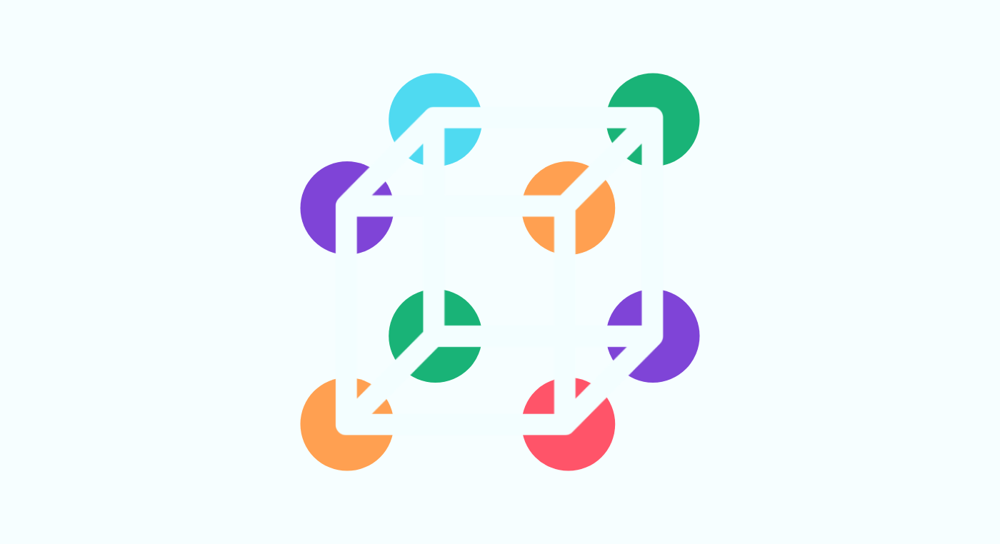
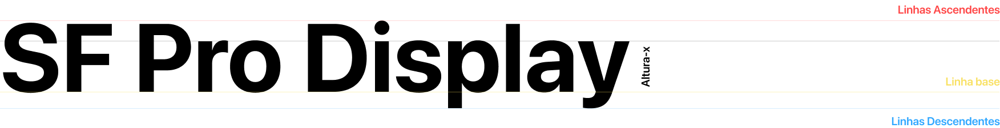

# Dicas para criar Layouts mais eficientes 

Ao entender o funcionamento do cérebro humano, podemos aprender a aproveitar a percepção humana para desencadear mudanças comportamentais.

Assim, podemos usar os princípios básicos da psicologia para tomar decisões mais informadas, garantindo que nossos aplicativos não sejam apenas atraentes, mas também eficazes. 

## O que você observa?

A maioria das pessoas consegue enxergar um cubo 3D, mas a verdade é que são apenas círculos cortados em três partes. 

Esse fenômeno foi observado e o termo **Gestalt** foi usado para definir esse estudo da psicologia cognitiva. Tal estudo explora as **leis da percepção** a partir dos dados que os indivíduos obtêm do mundo.  São 7 os princípios de Gestalt: Proximidade; Similaridade; Continuidade; Fechamento; Figura-fundo; Região comum; e Ponto focal. Não é o intuito deste artigo explorar cada um deles, apenas demonstrar o quanto devemos pensar a respeito quando formos desenvolver nossos *Layouts* e *Aplicativos*.

Afinal não podemos esquecer que uma das prioridades de um bom aplicativo é fazer com que o usuário esteja no centro das atenções durante todo o processo. 

# Pontos a se refletir

## Tipografia

A maioria das fontes profissionais são criadas baseadas em diversos conceitos e padrões de design.

Um desses conceitos é a **altura-x**. Esse conceito representa a altura do caractere **x** ( *minúsculo* ) , que é uma referência para o tamanho e proporção da fonte. 

Nosso cérebro processa melhor quando visualiza ambientes organizados e proporcionais. 

**No Android, a maioria das fontes com maior aceitação possuem dimensões proporcionais, onde muitas delas têm a *altura-x* correspondente à metade do *textSize* , medidos em *sp*.** 

As fontes com ***altura-x*** alta têm melhor legibilidade em tamanhos de fonte pequenos, pois o espaço em branco dentro de cada letra é mais legível.

Mas  fontes são um caso a parte...  Quem quiser se aventurar, indico um livro a respeito [Elementos do Estilo Tipográfico, de Robert Bringhurst ](https://www.amazon.com.br/Elementos-Estilo-Tipogr%C3%A1fico-Vers%C3%A3o-4-0/dp/8540507064/ref=sr_1_2?__mk_pt_BR=%C3%85M%C3%85%C5%BD%C3%95%C3%91&dchild=1&keywords=Robert+Bringhurst&qid=1632894546&sr=8-2)

## Sistema Espacial

Em um Sistema Espacial, os métodos de espaçamento usam grades de linha de base, linhas-chave, preenchimento e espaçamento incremental para ajustar proporções, recipientes e alvos de toque.

O Sistema Espacial mais harmonico é baseado em uma grade de linha de base quadrada de 8dp e servem tanto para celulares, tablets e desktops. No Android a indicação do próprio Material Design é  utilizarmos este sistema de medidas como diferença entre **paddings** e **margens** numa construção dos componentes.

## Cards / Sliders / Lists

O simples fato de que o componente de carrossel está cortado nos limites da tela cria esta ilusão e enfatiza a função de se arrastar para ver mais itens.  Esse é baseado em um dos conceitos de Gestalt, o da Continuidade.  Esse conceito deve ser pensado também ao se criar Listas, Cards, etc.

## Cores

Se colocarmos dois objetos identicos em um Layout sendo o primeiro com a cor primária e o segundo com a cor secondária, a regra é: a cor prímária deve sempre chamar mais atenção que a cor secundária!

A não ser se precisarmos utilizar cores especificas, o ideal é seguir o mestre. A Google, no site do Material Design já nos dá uma paleta de cores harmônicas com os padrões do Android, que os usuários já estão acostumados a ver, além de ferramentas para criar nosssas próprias paletas: [Veja Aqui](https://material.io/design/color/the-color-system.html#color-usage-and-palettes)

Quando se fala em cores, indico site com tendências e paletas: o [ColorLovers](https://www.colourlovers.com/)

Uma ferramenta muito interessante também é a [COPASO](https://www.colourlovers.com/copaso/ColorPaletteSoftware) que nos ajuda a criar harmonização e composição de cores e paletas com BEND, COMP, TRIAD, TETRAD e SPLIT
